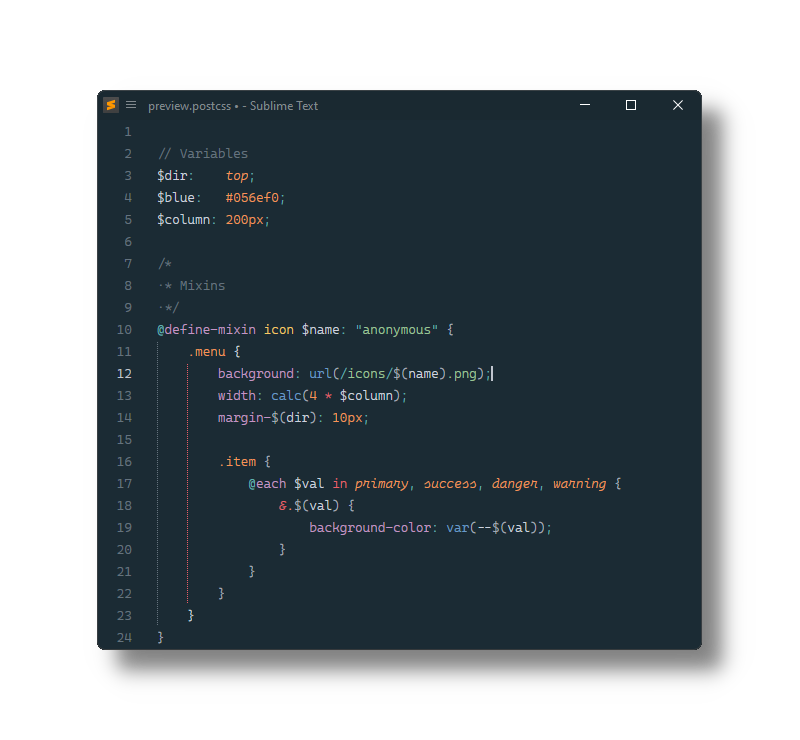

# PostCSS

[PostCSS](https://github.com/postcss/postcss) syntax definitions for [Sublime Text](https://www.sublimetext.com).

## Installation

### Package Control

The easiest way to install is using [Package Control](https://packagecontrol.io). It's listed as `PostCSS`.

1. Open `Command Palette` using <kbd>ctrl+shift+P</kbd> or menu item `Tools → Command Palette...`
2. Choose `Package Control: Install Package`
3. Find `PostCSS` and hit <kbd>Enter</kbd>

### Manual Install

1. Download appropriate [PostCSS.sublime-package](https://github.com/SublimeText/PostCSS/releases) for your Sublime Text build.
   _A suffix (e.g. `-st4xxx`) denotes the least required ST build for the sublime-package to work._
2. Rename it to _PostCSS.sublime-package_
3. Copy it into _Installed Packages_ directory

> [!NOTE]
>
> To find _Installed Packages_...
>
> 1. call _Menu > Preferences > Browse Packages.._
> 2. Navigate to parent folder

> [!WARNING]
>
> Manually installed packages are not automatically updated by Package Control.

## Troubleshooting

PostCSS extends Sublime Text's CSS syntax definition as of ST4152.

If PostCSS syntax highlighting doesn't work and console displays syntax errors, 

1. check if CSS package is enabled.
2. remove any out-dated syntax override.
   
### Enable CSS package

1. Open `Command Palette` using <kbd>ctrl+shift+P</kbd> or menu item `Tools → Command Palette...`
2. Choose `Package Control: Enable Packages`
3. Find `CSS` and hit <kbd>Enter</kbd>

### Remove overrides

1. call _Menu > Preferences > Browse Packages.._
2. Look for _CSS_ folder
3. Remove it or at least delete any _CSS.sublime-syntax_ in it
